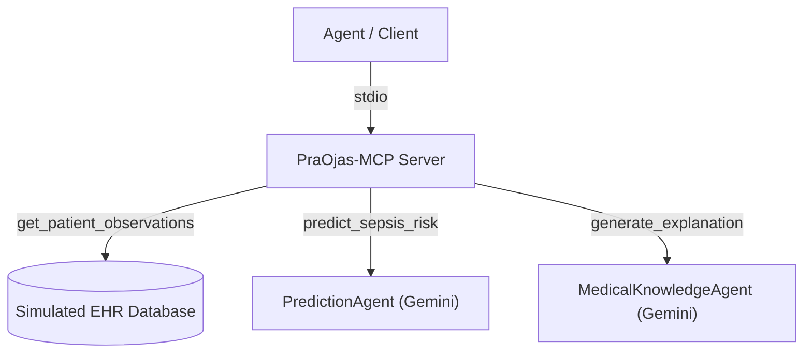

# PraOjas MCP Server — Model Context Protocol

This directory contains the **Model Context Protocol (MCP)** server for PraOjas AI. 

The MCP server exposes clinical AI tools that agents can call to retrieve data and execute inference workflows — a key component of modern agentic architectures.

---

## 🚀 Active MCP Server (`PraOjas-MCP`)

**File:** `server.ts`

The PraOjas MCP server is fully implemented using the `@modelcontextprotocol/sdk` and runs via `stdio` transport. It bridges the AI agents with the simulated EHR database and the clinical inference engines.

### Available Tools

| Tool | Description | Parameters |
|------|-------------|------------|
| `get_patient_observations` | Fetch patient vitals and labs from the FHIR database | `patientId` (string) |
| `predict_sepsis_risk` | Run AI sepsis and mortality prediction based on patient clinical data | `patientJson` (string) |
| `generate_explanation` | Generate a clinical explanation for the given prediction | `patientJson` (string), `predictionJson` (string) |

### Architecture



### Running the Server

The server can be started using the `@modelcontextprotocol/sdk`:
```bash
npx tsx server.ts
```

---

## References

- [Model Context Protocol Specification](https://modelcontextprotocol.io/)
- [Google Agent Development Kit (ADK)](https://google.github.io/adk-docs/)
- [FHIR R4 Specification](https://hl7.org/fhir/R4/)
