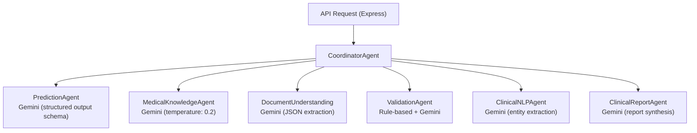

# Server — Multi-Agent System (MAS)

This directory contains the **Node.js Multi-Agent System** that powers PraOjas AI.
Each agent is a TypeScript class that encapsulates a specialized clinical AI capability, powered by the Google Gemini API.

All agents are orchestrated by the `CoordinatorAgent`, which is instantiated in [`server.ts`](../server.ts) and mapped to REST API endpoints.

---

## Agent Descriptions

### `CoordinatorAgent.ts`
**Role:** Orchestrator / Router

The primary interface between the Express API layer and the agent ecosystem. It does not perform any AI work itself — it delegates every request to the appropriate sub-agent(s) and aggregates results.

**Methods:**
| Method | Description |
|--------|-------------|
| `handlePredictionRequest(patient)` | Routes to `PredictionAgent` |
| `handleExplanationRequest(patient, prediction)` | Routes to `ClinicalNLPAgent` → `MedicalKnowledgeAgent` → `ClinicalReportAgent` |
| `handleDocumentUpload(documentText)` | Routes to `DocumentUnderstandingAgent` → `ValidationAgent` |
| `handleSmartVitalsRequest(patient)` | Routes to `MedicalKnowledgeAgent` |

---

### `PredictionAgent.ts`
**Role:** Risk Predictor

Uses Gemini as a zero/few-shot clinical predictor. Given structured patient vitals and lab values, it returns:
- `sepsisProbability` (0.0 – 1.0)
- `mortalityProbability` (0.0 – 1.0)
- `confidenceScore` (0.0 – 1.0)

Supports an optional fine-tuned Gemini model via the `GEMINI_TUNED_MODEL_NAME` env var.

---

### `MedicalKnowledgeAgent.ts`
**Role:** Explainability + Smart Vitals

Uses Gemini 2.5 to:
1. **Generate explanations** — Cross-references predictions with clinical guidelines and generates natural language reasoning mimicking SHAP / Integrated Gradients feature importance (e.g., *"The primary driver for this sepsis risk score is elevated Lactate..."*).
2. **Suggest smart vitals** — Simulates the next plausible vitals progression based on patient status and physiological trends.

---

### `DocumentUnderstandingAgent.ts`
**Role:** Document Parser

Accepts raw clinical text (extracted from PDFs, CSVs, or typed notes) and uses Gemini to extract structured patient data (vitals, labs, clinical notes) in a consistent JSON format.

---

### `ValidationAgent.ts`
**Role:** Data Validator

Validates the structured data output from `DocumentUnderstandingAgent`. Checks for:
- Missing required fields
- Values outside physiologically plausible ranges
- Anomalous combinations (e.g., SpO2 > 100%)

Returns corrected data and a list of `warnings` for the clinician.

---

### `ClinicalNLPAgent.ts`
**Role:** Medical Entity Extractor

Processes free-form clinical notes using Gemini to extract:
- **Diagnoses** (ICD-10 style)
- **Medications** (with dosage if available)
- **Symptoms** (onset, severity)
- **Procedures** (recent interventions)

---

### `ClinicalReportAgent.ts`
**Role:** Report Generator

Aggregates prediction results, explainability data, and NLP entities into a structured clinical risk summary. The output is a JSON payload used by the frontend to render the handoff summary modal and generate PDF reports.

---

## Agent Communication Flow

---

## Adding a New Agent

1. Create `server/agents/MyNewAgent.ts` with a class that takes `apiKey: string` in its constructor.
2. Add it as a dependency in `CoordinatorAgent.ts`.
3. Add a new `handleXxx()` method in `CoordinatorAgent.ts`.
4. Add a corresponding API route in `server.ts`.
